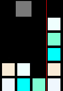

# BlocksWorld

Creates a BlocksWorld simulator or problem generator!

This project utilizes openaigym API for consistent access.

## Action Space
The action space is defined as a Discrete space {0, 1, 2, 3}.
* 0: Move the hand left (will not move if at left most pos).
* 1: Move the hand right (will not move if at right most pos).
* 2: Grab the block below (will not act if there is no block or is already holding a block).
* 3: Release block (will not act if not holding a block).

## Observation Space
The obeservation space is defined as a dictionaryr of three objects: {'world' , 'holding', 'location'}.
* world: Is an NxM array of integers. Its width is the set world length and its height is the number of blocks. The integers correspond to the block number.
* holding: Is an int when holding a block. The int is that block's number. Is None when holding nothing.
* location: Is an int indicating where the hand is. Ranges from [0, world_length).

## Reward
The reward is currently defined as the euclidean distance between the goal state and the current state. This only considers the (x,y) distance between individual blocks. The reward decreases as the world progresses to the goal state. May involve requring a decrease in performance to solve the problem (unstack blocks). The smallest reward is zero. 

## Speed
* Can draw 10k frame updates in 1.5 seconds.
* Can run 10k steps in 0.01 seconds without logging.

## Todo
* Apply common AI solutions to the domain.
* Come up with a solving algorithm.
* Consider solving algorithm as a reward measure.
* Add hamiltonian distance as reward measure.
* Error catching and logging
* Make compatible with keras-rl
